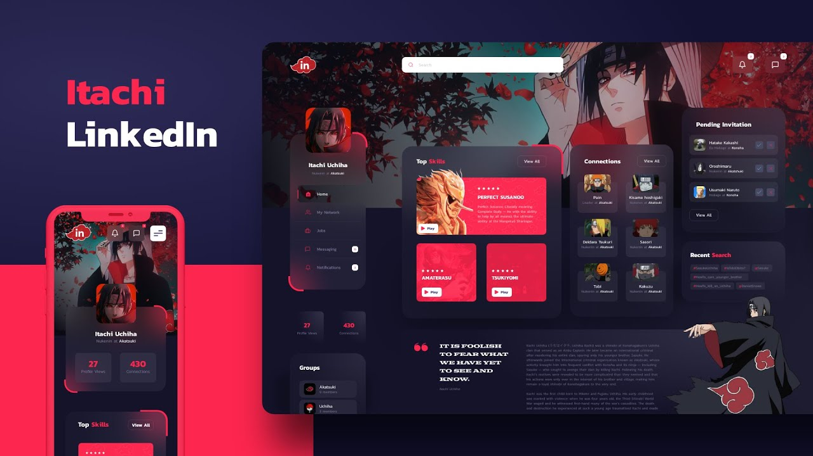

## Itachi LinkedIn

[](https://github.com/lucaslousada)
[](#)
[](#)

Design criado por [Daniel Snows](https://youtu.be/kxNgW_F7H_w) e a aplicação desenvolvida por mim.

🚧 Em construção... 🚧



## Tecnologias

Esse projeto foi desenvolvido com as seguintes tecnologias:

- HTML
- SASS
- TypeScript
- ReactJS

## Iniciando

Você precisa instalar o [Node.js](https://nodejs.org/en/download/) e o [Yarn](https://yarnpkg.com/) para executar este projeto.

```bash
$ git clone https://github.com/lucaslousada/itachi-linkedin.git
$ cd itachi-linkedin
$ yarn
$ yarn start
```
Acesse: `http://localhost:3000`

## Créditos

Siga o autor original: [@danielsnows](https://www.instagram.com/danielsnows/)